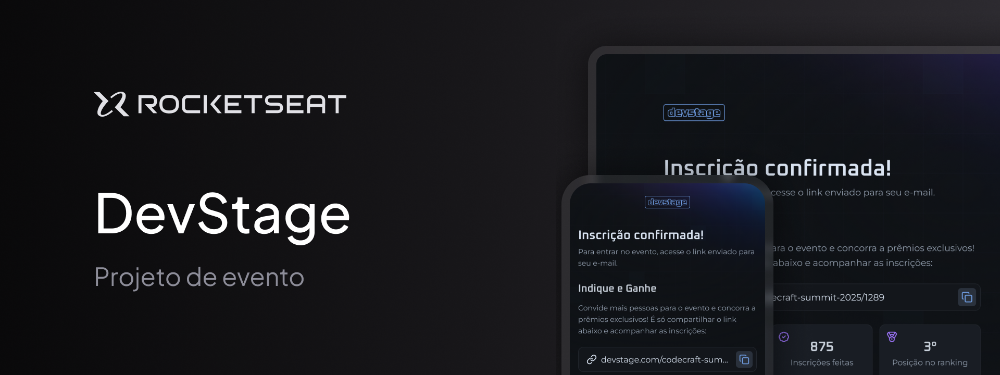

# 🔴 Dev Stage - NLW Connect

Este projeto foi desenvolvido durante a **NLW Connect** de 2025 pela RocketSeat, onde o desafio foi recriar o design feito pela Millena Martins de um projeto sobre eventos.

## 🚀 Tecnologias utilizadas

- **Next.js** - Para renderização eficiente e melhor experiência do usuário 
- **Tailwind CSS** - Para estilização rápida e responsiva   
- **Zod** - Manipulação e verificação de formulários

## 🎨 Funcionalidades

## 📦 Como rodar o projeto localmente

1. Clone este repositório:  
   ```sh
   git clone https://github.com/EaCamih/NLW-2025.git
   ```
2. Acesse a pasta do projeto:  
   ```sh
   cd NLW-2025
   ```
3. Instale as dependências:  
   ```sh
   npm install
   ```
   ou
   ```sh
   yarn install
   ```
4. Inicie o servidor de desenvolvimento:  
   ```sh
   npm run dev
   ```
   ou
   ```sh
   yarn dev
   ```
6. Acesse `http://localhost:3000` no navegador

## 📜 Licença

Este projeto está sob a licença MIT. Sinta-se à vontade para contribuir!

---
Desenvolvido pela [Camilla Viana](https://github.com/EaCamih) 💜